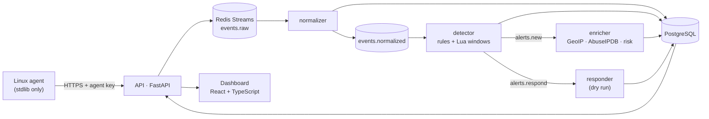

# SentinelLite

[](https://github.com/yassineeljal/SentinelLite/actions/workflows/ci.yml)

A small, self-hosted **SIEM**: agents ship Linux logs to a platform that normalizes them, detects
attacks with rules mapped to **MITRE ATT&CK**, enriches alerts (GeoIP, IP reputation, explainable risk
score), lets analysts triage them in a web dashboard, and decides — with strict guardrails — which
attackers would be blocked.

It is built to be **measurable**: every rule ships with labelled attack, benign and near-miss
scenarios, and CI fails if the detection benchmark drifts.

## Numbers (reproducible: `sentinel bench`)

| | |
|---|---|
| Detection rules | **13** (ATT&CK-mapped: T1110, T1078, T1136, T1098, T1548, T1087) |
| Attack scenarios detected | **51 / 51** |
| Scenarios matching their exact expected alert count | **88 / 88** |
| False alerts on 706 replayed benign events | **0** |
| Automated tests | **1 151** (real Redis and PostgreSQL in CI), `mypy --strict`, `ruff` |
| Attack → alert latency (real `hydra` → `sshd` → agent → alert) | **7.4 s** |

Full per-rule figures: [`docs/BENCHMARK.md`](docs/BENCHMARK.md) (generated, checked by CI).

## Architecture



**Dumb agents, smart server.** Agents only tail files and ship raw lines; all parsing lives on the
server, so a parser bug is fixed without redeploying agents and raw events can be replayed.
Design record: [`docs/ARCHITECTURE.md`](docs/ARCHITECTURE.md) (38 decisions with the alternatives
that were rejected) and a dated engineering log, [`docs/DEVLOG.md`](docs/DEVLOG.md).

## What it does

- **Collection** — Linux agent (`auth.log`), at-least-once delivery with a disk-backed position,
  rotation and truncation handling, exponential backoff, hardened `systemd` unit. It refuses to
  disable TLS verification and never reads its key from a config file.
- **Ingestion** — authenticated batches, size limits, explicit backpressure (`429` + `Retry-After`)
  instead of silently dropping events; poison input is quarantined in a dead-letter table.
- **Detection** — YAML rules validated strictly at load time (an unknown key refuses to load, so a typo
  can never become a silently missing detection). Threshold, distinct-count, sequence, stateful
  (impossible travel) rules; event-time sliding windows evaluated by an **atomic Lua script** in Redis;
  time-of-day conditions with mandatory time zones. [`docs/DETECTION.md`](docs/DETECTION.md)
- **Enrichment** — local GeoIP, optional AbuseIPDB (cached, quota-aware), and a risk score whose factors
  are listed, not a black box. Off the detection path: a slow provider can never delay an alert.
- **Dashboard** — alert list and detail with evidence, ATT&CK coverage, source map, incident triage,
  optional TOTP two-factor authentication, login throttling. Argon2id, server-side sessions,
  `HttpOnly`/`SameSite=Strict` cookies, no self-registration.
- **Response (dry run)** — decides which sources *would* be blocked: only sweeping/guessing rules, public
  addresses only, an allowlist that always wins (IPv4-mapped IPv6 included), a mandatory TTL, a rate cap,
  an append-only audit log. Enforcement is refused until agents can execute actions.
  [`docs/OPERATIONS.md`](docs/OPERATIONS.md)

## Quick start

```bash
cd deploy
cp .env.example .env                 # set a strong POSTGRES_PASSWORD
docker compose up -d --build         # postgres, redis, migrations, api, normalizer, detector
docker compose exec api sentinel users create --email you@example.com --role admin
docker compose exec api sentinel agents create --name my-host --os linux   # prints the agent key once
open http://localhost:8000
```

Install the agent on a monitored host: [`docs/AGENT.md`](docs/AGENT.md). Run the detection benchmark
without any service: `cd backend && uv run sentinel bench`. Optional profiles: GeoIP enrichment and the
dry-run responder ([`docs/OPERATIONS.md`](docs/OPERATIONS.md)). A lab with a real attacker (Kali, `hydra`):
[`lab/README.md`](lab/README.md).

## Engineering notes

Bugs and design points that came from running it, all recorded in the devlog:

- **Hardening blinded two rules.** Deployed on a public VPS that only accepts SSH keys, the dashboard stayed
  empty while the server was probed all day: `sshd` no longer logs `Failed password`, so the brute-force
  rule could not fire, and the enumeration rule ignores one name tried many times. A new rule
  (`ssh-invalid-user-flood`) now covers it, threshold chosen against the existing benign data.
- **A shared Docker network answered to the wrong name.** The API, attached to the platform's network and
  to a reverse proxy's, resolved `postgres` to *another stack's* database. Found by resolving the name
  from inside the container, fixed with unique aliases.
- **`ipaddress.is_global` is not "safe to block".** A test showed multicast (`224.0.0.1`) reported as
  global, and `::ffff:10.0.0.1` must be judged as the private IPv4 it wraps.
- **One stream, one consumer group.** Consumers delete what they acknowledge, so the responder has its own
  stream instead of starving the enricher.
- Attacker-controlled text (user names, addresses, log lines) is treated as hostile everywhere: a user
  name cannot spoof the source IP in a parsed line, terminal output is sanitised, untrusted values are
  cut before they reach the audit log.

## Repository layout

| Path | Contents |
|---|---|
| `backend/` | FastAPI API, workers (normalizer, detector, enricher, responder), detection engine, CLI, Alembic migrations |
| `agents/linux/` | The Linux log agent (Python standard library only) and its `systemd` unit |
| `frontend/` | React + Vite + TypeScript dashboard |
| `rules/` | Detection rules (YAML) |
| `datasets/` | Labelled attack / benign / near-miss log scenarios used by the benchmark |
| `deploy/` | Dockerfile, Compose stack, VPS overlay |
| `lab/` | Attack lab scripts and notes |
| `docs/` | Architecture, detection, operations, ingestion API, benchmark, devlog |

## Status

Milestones M0–M4 (foundations, vertical slice, detection, enrichment, dashboard) are done; **M5 (response)** is
in progress: decisions, guardrails and the agent action channel (firewall enforcer) are in, a live dry-run then a first real block on the VPS are next; then a Windows/Sysmon
agent (M6) and polish (M7). It runs on a public VPS behind an HTTPS reverse proxy, monitoring the SSH traffic
that server actually receives.

Out of scope for v1: high availability, multi-tenancy, ML anomaly detection, EDR.
