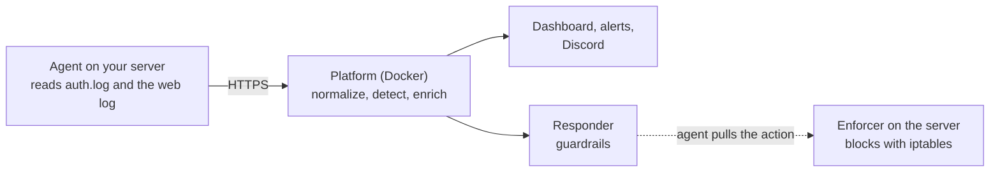

# SentinelLite

[](https://github.com/yassineeljal/SentinelLite/actions/workflows/ci.yml)

**[Tutorial](docs/TUTORIAL.md)** · [Demo](docs/DEMO.md) · [Features](docs/FEATURES.md) · [Architecture](docs/ARCHITECTURE.md) · [Benchmark](docs/BENCHMARK.md) · [Compared with Wazuh](docs/COMPARISON.md)

**A small, self-hosted SIEM for Linux servers.** It reads your SSH and web logs, raises an alert
(mapped to MITRE ATT&CK) when someone scans your server or guesses passwords, and can block the
persistent attackers on the firewall, with strict safeguards and a full audit trail.

- **Measured.** Every detection rule ships with labelled attack, benign and near-miss scenarios, and CI
  fails if the benchmark drifts.
- **Running for real.** It monitors the public server it is hosted on; a real block was applied and lifted
  there.
- **Safe by design.** Blocking is off until you turn it on, starts in *dry run*, never touches private
  addresses, always obeys your allowlist, and every block expires.

## Who is it for?

You run a few Linux servers (a VPS, a homelab) and want to *see* who is knocking, and to block the
persistent ones automatically, without operating a large product. Or you want to learn how a SIEM works:
it is small enough to read, and every design decision is written down with the alternatives that were
rejected.

It is **not** a replacement for a mature product on a large or regulated estate: Linux only, one instance,
no high availability. The [comparison with Wazuh](docs/COMPARISON.md) is candid about it.

## How it works



The agent only ships raw log lines; all the intelligence lives on the platform, so a fix never needs a
redeploy of your servers. Response actions are *pulled* by the server: no inbound port is opened on a
monitored host. The [full picture](docs/FEATURES.md) has every component.

## Numbers (reproducible with `sentinel bench`)

| | |
|---|---|
| Detection rules | **16**, mapped to MITRE ATT&CK |
| Attack scenarios detected | **67 / 67** |
| Scenarios matching their exact expected alert count | **118 / 118** |
| False alerts on 1 050 replayed benign events | **0** |
| Attack → alert, SSH (real `hydra` against `sshd`) | **7.4 s** |
| Attack → alert, web scan (on the live server) | **under 0.4 s** once the event reaches the platform |

Over 1 600 automated tests run in CI (real Redis and PostgreSQL), with `mypy --strict` and `ruff`.
Per-rule figures: [`docs/BENCHMARK.md`](docs/BENCHMARK.md) (generated, checked by CI).

## Get started

The [**tutorial**](docs/TUTORIAL.md) takes you from an empty machine to your first alert in about 30
minutes. The short version:

```bash
git clone https://github.com/yassineeljal/SentinelLite.git && cd SentinelLite/deploy
cp .env.example .env
# edit .env: set POSTGRES_PASSWORD, and for a first try over plain http://localhost also
#            SENTINEL_SESSION_COOKIE_SECURE=false   (remove it once you use HTTPS)
docker compose -f docker-compose.yml -f docker-compose.images.yml up -d   # published image, nothing to build
#   (or `docker compose up -d --build` to build from the source)
docker compose exec api sentinel users create --email you@example.com --role admin
docker compose exec api sentinel agents create --name my-host --os linux   # prints the agent key once
```

Open <http://127.0.0.1:8000> and sign in. Then, **on the Linux server you want to watch**, one command
installs the agent (your platform serves it, so the versions always match):

```bash
curl -fsSL https://YOUR-PLATFORM/agent/install.sh | sudo bash -s -- --server https://YOUR-PLATFORM --key <the key>
```

The platform runs in Docker; the agent is a small hardened `systemd` service, because it has to read the
host's real logs and, if you enable the response, edit its firewall.

## What you can do with it

- **See who is attacking**: SSH guessing and enumeration, patient scanners, web path scans, password
  guessing on your own dashboard.
- **Understand an alert**: the exact log lines, the ATT&CK technique, where it came from, and a risk score
  that lists the reason for every factor.
- **Respond**: block persistent attackers automatically (dry run first), lift a block in one command.
- **Stay informed**: Discord messages for blocks, an alert when one of your agents goes silent, a printable
  security report.

More detail, and how each piece works: [`docs/FEATURES.md`](docs/FEATURES.md).

## Documentation

| I want to… | Read |
|---|---|
| Install it and get my first alert | [`docs/TUTORIAL.md`](docs/TUTORIAL.md) |
| Run it: backups, updates, response, Discord, GeoIP, web logs | [`docs/OPERATIONS.md`](docs/OPERATIONS.md) |
| Install the agent and the firewall enforcer | [`docs/AGENT.md`](docs/AGENT.md) |
| Write or change a detection rule | [`docs/DETECTION.md`](docs/DETECTION.md), [`docs/EVENTS.md`](docs/EVENTS.md) |
| Use the dashboard, accounts and 2FA | [`docs/DASHBOARD.md`](docs/DASHBOARD.md) |
| Understand the design and its trade-offs | [`docs/ARCHITECTURE.md`](docs/ARCHITECTURE.md), [`docs/ENGINEERING_NOTES.md`](docs/ENGINEERING_NOTES.md), [`docs/DEVLOG.md`](docs/DEVLOG.md) |
| See it in three minutes | [`docs/DEMO.md`](docs/DEMO.md) |
| Talk to the ingestion API | [`docs/INGESTION_API.md`](docs/INGESTION_API.md) |

## FAQ

**Does it block attackers on its own?** Only if you turn it on, and it starts in `dry_run`: it records
what it *would* block and touches nothing. Enforcing needs a separate service on each server.

**Can it lock me out?** It is designed not to (private and loopback ranges are never blocked, your own
addresses go in an allowlist), and a block is undone with `sentinel unblock` or, if the platform is down,
`iptables -F SENTINEL` on the server. Still: allowlist your own address *before* enabling anything.

**Does any data leave my server?** No, by default. GeoIP is a local database. IP reputation (AbuseIPDB) is
off unless you give it a key, and it then sends the public source address of alerts to abuseipdb.com.

**Which systems can it monitor?** Linux servers with `sshd` (Ubuntu 24.04 is the tested one) and,
optionally, a Traefik access log. There is no Windows agent, by design.

**Why is the agent outside Docker?** It reads the machine's real log files and changes its real firewall;
a container would be cut off from both.

## Status and limits

Working and running on a public VPS: SSH and web detection, Discord notifications, the watchdog, the Blocks
page, and the responder in `dry_run`. What remains is a decision, not code: review a few days of dry-run
blocks and, if every one is a real attacker, switch to `enforce` ([procedure](docs/OPERATIONS.md)).

Known limits: two log sources, Linux only; a scan spread over many addresses is not caught; nothing purges
old events yet (watch the database size); the platform's own workers are not monitored. Out of scope: high
availability, multi-tenancy, machine-learning detection, EDR.

## License

No license has been chosen yet, so for now all rights are reserved: please open an issue before reusing the
code. Bug reports and questions are welcome as GitHub issues; please report security problems privately to
the maintainer, not publicly.
