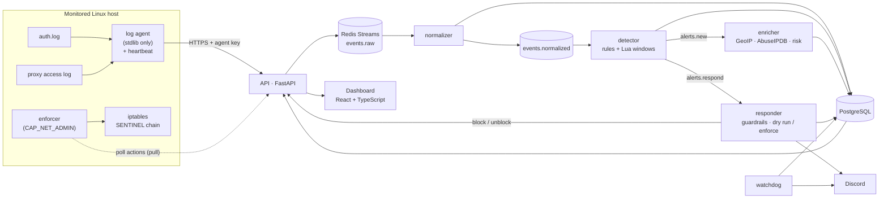

# SentinelLite

[](https://github.com/yassineeljal/SentinelLite/actions/workflows/ci.yml)

**[Tutorial](docs/TUTORIAL.md)** · [Three-minute demo](docs/DEMO.md) · [Architecture](docs/ARCHITECTURE.md) · [Benchmark](docs/BENCHMARK.md) · [Comparison with Wazuh](docs/COMPARISON.md)

A small, self-hosted **SIEM** for Linux servers: agents ship SSH and web logs to a platform that
normalizes them, detects attacks with rules mapped to **MITRE ATT&CK**, enriches alerts (GeoIP, IP
reputation, explainable risk score), lets analysts triage them in a web dashboard, and blocks
attackers on the firewall, behind strict guardrails, with a full audit trail.

It is built to be **measurable**: every rule ships with labelled attack, benign and near-miss
scenarios, and CI fails if the detection benchmark drifts. It is also **running for real**: it
monitors the public VPS it is hosted on, and a real block was applied and lifted there.

## Who is it for?

- **You run a few Linux servers** (a VPS, a homelab) and want to *see* who is scanning and guessing
  passwords, and to block the persistent ones automatically, without operating a large product.
- **You want to learn how a SIEM works**: it is small enough to read, every design decision is written
  down with the alternatives that were rejected, and every detection is measured.

It is **not** a replacement for a mature product on a large or regulated estate: Linux only, two log
sources, one instance, no high availability. The [comparison](docs/COMPARISON.md) is candid about it.

## Numbers (reproducible: `sentinel bench`)

| | |
|---|---|
| Detection rules | **16** (ATT&CK-mapped: T1110, T1078, T1136, T1098, T1548, T1087, T1595) |
| Attack scenarios detected | **67 / 67** |
| Scenarios matching their exact expected alert count | **118 / 118** |
| False alerts on 1 050 replayed benign events | **0** |
| Automated tests | **1 343** backend (real Redis and PostgreSQL in CI) + **173** agent + **80** frontend; `mypy --strict`, `ruff` |
| Attack → alert latency, SSH (real `hydra` → `sshd` → agent → alert) | **7.4 s** |
| Attack → alert latency, web (probe sweep on the live VPS) | **< 0.4 s** after the event reaches the platform |

Full per-rule figures: [`docs/BENCHMARK.md`](docs/BENCHMARK.md) (generated, checked by CI). How it compares
with Wazuh, honestly: [`docs/COMPARISON.md`](docs/COMPARISON.md).

## Architecture



**Dumb agents, smart server.** Agents only tail files and ship raw lines; all parsing lives on the
server, so a parser bug is fixed without redeploying agents and raw events can be replayed.
**Pull, not push.** Response actions are fetched by the agent: no port is opened on a monitored host, no
privileged key is stored on the platform. Design record: [`docs/ARCHITECTURE.md`](docs/ARCHITECTURE.md)
(42 decisions with the alternatives that were rejected) and a dated engineering log,
[`docs/DEVLOG.md`](docs/DEVLOG.md).

## What it does

- **Collection** — a Linux agent tails `auth.log` and the reverse proxy's JSON access log:
  at-least-once delivery with a disk-backed position, rotation and truncation handling, exponential
  backoff, hardened `systemd` unit, a heartbeat every minute. It refuses to disable TLS verification and
  never reads its key from a config file. [`docs/AGENT.md`](docs/AGENT.md)
- **Ingestion** — authenticated batches, size limits, explicit backpressure (`429` + `Retry-After`)
  instead of silently dropping events; poison input is quarantined in a dead-letter table.
- **Detection** — YAML rules validated strictly at load time (an unknown key refuses to load, so a typo
  can never become a silently missing detection). Threshold, distinct-count, sequence and stateful
  (impossible travel) rules; event-time sliding windows evaluated by an **atomic Lua script** in Redis;
  time-of-day conditions with mandatory time zones. SSH guessing and enumeration, sudo and account
  changes, web path scanning and login guessing. [`docs/DETECTION.md`](docs/DETECTION.md)
- **Enrichment** — local GeoIP, optional AbuseIPDB (cached, quota-aware), and a risk score whose factors
  are listed, not a black box. Off the detection path: a slow provider can never delay an alert.
- **Response** — the responder decides which sources to block: only sweeping/guessing rules, public
  addresses only, an allowlist that always wins (IPv4-mapped IPv6 included), a mandatory TTL, a rate cap,
  an append-only audit log. In `enforce` a separate **enforcer** service on the host applies the block to
  `iptables` and lifts it at its end time even if the platform is gone; the agent re-checks every
  address itself, so a compromised platform can at worst drop traffic from a bounded set of public
  addresses for a bounded time. `dry_run` is the default. [`docs/OPERATIONS.md`](docs/OPERATIONS.md)
- **Operate** — Discord notifications (blocks, releases), a **watchdog** that announces an agent that
  stopped reporting, `sentinel unblock`, and `sentinel report`, a printable HTML security report.
- **Dashboard** — alert list and detail with evidence, ATT&CK coverage, source map, incident triage, a
  Blocks page (admin-only actions, audited), optional TOTP two-factor authentication, login throttling.
  Argon2id, server-side sessions, `HttpOnly`/`SameSite=Strict` cookies, no self-registration.
  [`docs/DASHBOARD.md`](docs/DASHBOARD.md)

## Get started

The [**tutorial**](docs/TUTORIAL.md) walks through everything, from an empty machine to your first alert
(about 30 minutes). The short version:

```bash
git clone https://github.com/yassineeljal/SentinelLite.git && cd SentinelLite/deploy
cp .env.example .env
# edit .env: set POSTGRES_PASSWORD, and for a first try over plain http://localhost also
#            SENTINEL_SESSION_COOKIE_SECURE=false   (remove it once you use HTTPS)
docker compose -f docker-compose.yml -f docker-compose.images.yml up -d   # the published image: nothing to build
#   (or `docker compose up -d --build` to build from the source)
docker compose exec api sentinel users create --email you@example.com --role admin
docker compose exec api sentinel agents create --name my-host --os linux   # prints the agent key once
```

Open <http://127.0.0.1:8000> and sign in. Then, **on the Linux server you want to watch**, one command
installs the agent (the platform serves it, so the versions always match):

```bash
curl -fsSL https://YOUR-PLATFORM/agent/install.sh | sudo bash -s -- --server https://YOUR-PLATFORM --key <the key>
```

The platform runs in Docker; the agent is a small hardened `systemd` service, because it has to read the
host's real logs and, if you enable the response, edit its firewall. Details:
[tutorial, step 5](docs/TUTORIAL.md#5-register-and-install-an-agent).

Other entry points: run the detection benchmark without any service (`cd backend && uv run sentinel bench`),
try a real attack in a lab with Kali and `hydra` ([`lab/README.md`](lab/README.md)), or see the
[three-minute demo](docs/DEMO.md).

## Documentation

| I want to… | Read |
|---|---|
| Install it and get my first alert | [`docs/TUTORIAL.md`](docs/TUTORIAL.md) |
| Run and administer it (backups, updates, response, Discord, GeoIP, web logs) | [`docs/OPERATIONS.md`](docs/OPERATIONS.md) |
| Install and configure the agent and the firewall enforcer | [`docs/AGENT.md`](docs/AGENT.md) |
| Write or change a detection rule | [`docs/DETECTION.md`](docs/DETECTION.md), event catalogue in [`docs/EVENTS.md`](docs/EVENTS.md) |
| Use the dashboard, accounts and 2FA | [`docs/DASHBOARD.md`](docs/DASHBOARD.md) |
| Understand the design and its trade-offs | [`docs/ARCHITECTURE.md`](docs/ARCHITECTURE.md) (42 decisions), [`docs/DEVLOG.md`](docs/DEVLOG.md) |
| Talk to the ingestion API | [`docs/INGESTION_API.md`](docs/INGESTION_API.md) |
| Check the detection figures | [`docs/BENCHMARK.md`](docs/BENCHMARK.md) |

## FAQ

**Does it block attackers on its own?** Only if you turn it on, and it starts in `dry_run`: it records
what it *would* block and touches nothing. Enforcing needs a separate service on each server, an
allowlist that always wins, and a limited lifetime for every block.

**Can it lock me out?** It is designed not to (private and loopback ranges are never blocked, your own
addresses go in an allowlist and in the agent's `never_block`), and a block is undone with one command
(`sentinel unblock`) or, if the platform is down, `iptables -F SENTINEL` on the server. Still: allowlist
your own address *before* enabling anything.

**Does any data leave my server?** No, by default. GeoIP is a local database. AbuseIPDB reputation is off
unless you give it a key, and it then sends the public source address of alerts to abuseipdb.com. Discord
notifications go to the webhook you configure.

**Which systems can it monitor?** Linux servers with `sshd` (Ubuntu 24.04 is the tested one) and,
optionally, a Traefik access log. There is no Windows agent by design.

**Does it store logs forever?** Events go into daily partitions; nothing purges old ones yet, so watch
the database size ([`OPERATIONS.md`](docs/OPERATIONS.md)).

**Do I have to build the image?** No: a multi-architecture image (amd64, arm64) is published on each version tag
(`ghcr.io/yassineeljal/sentinellite`, first release `0.1.0`; use `docker-compose.images.yml`). Building from
the source stays possible.

**Why an agent outside Docker?** It reads the machine's real log files and changes its real firewall; a
container would be cut off from both.

## License and contributing

No license has been chosen yet, so for now all rights are reserved: please open an issue before reusing
the code. Bug reports and questions are welcome as GitHub issues. Security problems: please do not post
them publicly, contact the maintainer directly.

## Engineering notes

Bugs and design points that came from running it, all recorded in the devlog:

- **Hardening blinded two rules.** Deployed on a public VPS that only accepts SSH keys, the dashboard stayed
  empty while the server was probed all day: `sshd` no longer logs `Failed password`, so the brute-force
  rule could not fire, and the enumeration rule ignores one name tried many times. A new rule
  (`ssh-invalid-user-flood`) now covers it, threshold chosen against the existing benign data.
- **A logging feedback loop, caught before it started.** The agents reach the API through the same proxy
  whose access log they ship: enabling that log would have made every shipped batch create the next line,
  forever. A dedicated router keeps the agents' own requests out of the log.
- **A single-page app answers 200 to `/.env`.** So the web probe rule classifies the *path* (whole
  segments: `/v1/alerts/environment` is not `/.env`), never the status. And an oversized path used to make
  the agent truncate the line, break the JSON and land the request in the dead letters, invisible to every
  rule: it is now recovered and treated as a probe.
- **A shared Docker network answered to the wrong name.** The API, attached to the platform's network and
  to a reverse proxy's, resolved `postgres` to *another stack's* database. Found by resolving the name
  from inside the container, fixed with unique aliases.
- **`ipaddress.is_global` is not "safe to block".** A test showed multicast (`224.0.0.1`) reported as
  global, and `::ffff:10.0.0.1` must be judged as the private IPv4 it wraps.
- **Tests could not have found this one.** The first real start of the enforcer failed: a root process
  limited to `CAP_NET_ADMIN` cannot read a `0600` key file of another user. And the faulty first unit
  also took ownership of the log agent's state directory and stopped it for 2 h 20 without a word,
  which is why the watchdog exists.
- One stream, one consumer group; attacker-controlled text is treated as hostile everywhere (a user name
  cannot spoof the source IP, terminal output and reports are escaped, untrusted values are cut before
  they reach the audit log).

## Repository layout

| Path | Contents |
|---|---|
| `backend/` | FastAPI API, workers (normalizer, detector, enricher, responder, watchdog), detection engine, CLI, Alembic migrations |
| `agents/linux/` | The Linux log agent and the firewall enforcer (Python standard library only), `systemd` units |
| `frontend/` | React + Vite + TypeScript dashboard |
| `rules/` | Detection rules (YAML) |
| `datasets/` | Labelled attack / benign / near-miss log scenarios used by the benchmark |
| `deploy/` | Dockerfile, Compose stack, VPS overlay, logrotate |
| `lab/` | Attack lab scripts and notes |
| `docs/` | Architecture, detection, operations, ingestion API, events, benchmark, comparison, demo, devlog |

## Status

Milestones M0 to M7 are done. What runs on the VPS: SSH and web detection, Discord notifications, the
watchdog, the Blocks page, and the responder in `dry_run`. One step remains, and it is a decision, not
code: review a few days of dry-run blocks (`sentinel blocks`, the Blocks page) and, if every one is a real
attacker, switch the responder to `enforce` ([procedure](docs/OPERATIONS.md)).

**Known limits.** Two log sources (the SSH auth log and Traefik's access log), Linux only (no Windows
agent: [ADR 40](docs/ARCHITECTURE.md)).
No agent-side buffering beyond the log file itself. A distributed scan (many addresses, few probes each) is
not caught by the web rules. The platform's own workers are not monitored. Out of scope for v1: high
availability, multi-tenancy, ML anomaly detection, EDR.
