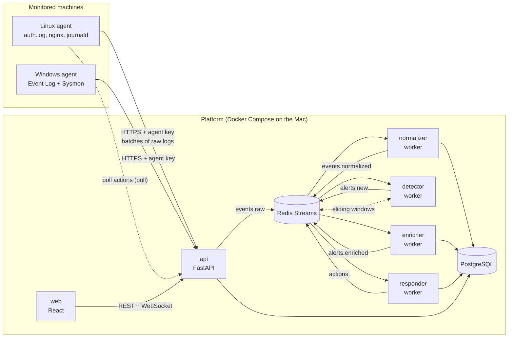

# SentinelLite — Architecture

> Status: **v0.2 — decisions on hosting, lab, notifications and language recorded.**
> This document is the reference. Any change of direction is recorded in the ADR section (§13).

## 1. Goals and constraints

**Goal**: collect logs (Linux, Windows, web), detect attacks mapped to MITRE ATT&CK, enrich alerts, respond automatically, and present everything in a web dashboard.

| Constraint | Consequence on the design |
|---|---|
| Solo developer, ~12 weeks | Few technologies, no "microservices for show" |
| Everything starts with `docker compose up` | Single repository, light images, configuration through environment variables |
| Isolated lab, Apple Silicon (M5) host | **All images and VMs are arm64**; the platform runs in Docker (OrbStack) on the Mac, the lab VMs run in UTM |
| The project must be **measurable** (detection rate, false positives, latency) | Metrics and labelled datasets from the start, not in week 11 |
| Destructive actions (IP blocking) | Safe by default: dry-run, allowlist, TTL, audit log |
| Everything in English (code, comments, commits, docs, UI) | See §11 conventions |

**Out of scope (v1)**: high availability, multi-tenancy, ML/anomaly detection, OpenSearch, EDR.

## 2. Overview



### Guiding principle

**Dumb agents, smart server.** Agents only read, tag the source (`source_type`) and ship raw lines. All normalization lives server-side: a parser can be fixed without redeploying agents, and raw events can be **replayed**.

## 3. Lab topology

The platform runs as a Docker Compose stack directly on the Mac (**OrbStack**). Three VMs on one isolated host-only network, hosted with **UTM** on the M5, reach it through the Mac's host-only IP:

| VM | Role | Notes |
|---|---|---|
| `target-linux` | Ubuntu Server (arm64): SSH, Nginx, `auth.log`, Linux agent | Attack target |
| `target-windows` | Windows 11 ARM + Sysmon + Windows agent | Attack target; ARM64 Sysmon support to be verified at M6 (fallback: replay `.evtx` files) |
| `attacker` | Kali Linux (arm64) | Attacks **our own machines only** |

Development, unit tests and integration runs all happen on the Mac. The API is published on `127.0.0.1` by default (`SENTINEL_BIND_ADDR`); once the lab exists it is bound to the host-only interface IP, **never** `0.0.0.0`. The same compose file can later be deployed in a dedicated `platform` VM for a more realistic demo. Only the `attacker` VM may generate attack traffic, and only towards the `target-*` VMs.

## 4. Components

| Component | Role | Tech | Scalable? |
|---|---|---|---|
| `agent` | Reads files/journals, buffers on disk, ships in batches, executes response actions | Python 3.12 (Linux), Python + `pywin32`/`wevtutil` (Windows) | One per machine |
| `api` | Authenticated ingestion, dashboard REST API, WebSocket, auth/RBAC/2FA | FastAPI, Pydantic v2 | Yes (stateless) |
| `normalizer` | Raw → common schema (one parser per `source_type`), writes to DB | Python worker | Yes (consumer group) |
| `detector` | Evaluates rules, keeps window state in Redis, emits alerts | Python worker | Yes (partitioned by key, see §7) |
| `enricher` | GeoIP (local GeoLite2), AbuseIPDB (cached + quota-aware), risk score | Python worker | Yes |
| `responder` | Decides (threshold, allowlist, dry-run), publishes actions, notifies **Discord**, schedules unblocks | Python worker | Single instance |
| `web` | Dashboard | React + Vite + TypeScript | Static |
| `postgres` | Events, alerts, incidents, users, audit | PostgreSQL 16 | — |
| `redis` | Message bus (Streams) + detection window state | Redis 7 | — |

The workers share **one Python package** (`sentinel_core`) with different entry points: one codebase, several containers. No separate microservice repos in v1.

## 5. Data flow

1. **Agent → API**: `POST /v1/ingest` with a batch (≤ 500 lines or 1 s). Authenticated by an agent key (stored hashed server-side). Returns `202` once the batch is written to Redis.
2. **API → `events.raw`** (Redis Stream): the raw payload is kept as-is with `agent_id`, `source_type`, `received_at`.
3. **Normalizer** (consumer group `normalizers`): parse → normalized event → insert into PostgreSQL (`events`, daily partitions) → acknowledge and delete the stream entry. Unparsable lines and sources without a normalizer go to `events_dead_letter` with the reason (never dropped silently). Publishing to `events.normalized` is added together with the detector (next milestone step), so that the stream is never filled without a consumer. See ADR 18.
4. **Detector** (consumer group `detectors`): reads `events.normalized`, applies the rules (`DetectionEngine` + `RedisWindowStore`), persists alerts in PostgreSQL, then acknowledges and deletes the entry. Publishing to `alerts.new` (for enrichment and response) is added with those components, for the same reason as before: no stream without a consumer. The normalizer stops reading `events.raw` while `events.normalized` is above its watermark (backpressure, ADR 20).
5. **Enricher**: adds geo, reputation and risk score → alert persisted → `alerts.enriched`.
6. **Responder**: if score ≥ threshold and IP not allowlisted → block action.
7. **Action execution**: the responder puts a command in `actions.<agent_id>`; the agent fetches it by **polling** (`GET /v1/agents/me/actions`), runs it (`ufw`/`iptables`) and confirms (`POST .../ack`).

### Guarantees

- **At-least-once** everywhere (Redis consumer groups + `XACK` after processing). Idempotency comes from a deterministic `event_id` (hash of `agent_id + source + offset/line`) with a `UNIQUE` constraint.
- **Backpressure**: `events.raw` has a high watermark (default 100 000 entries). Above it the API answers `429` + `Retry-After` and the agent retries from its disk buffer. The stream is deliberately **not** trimmed with `MAXLEN`: that would silently drop events that were never processed (ADR 14). Consumers delete entries after acknowledging them.
- **Ingestion contract**: see [`INGESTION_API.md`](INGESTION_API.md) (authentication, limits, status codes).
- **Pull for actions**: no inbound connection to monitored machines, no port open on the agent side.

## 6. Common event schema

Inspired by ECS (Elastic Common Schema) to stay standard and Sigma-compatible.

```jsonc
{
  "event_id":   "sha256(...)",          // idempotency
  "ts":         "2026-09-24T15:04:05Z", // event time (UTC)
  "received_at":"2026-09-24T15:04:06Z",
  "agent_id":   "uuid",
  "host":       "ubuntu-01",
  "source":     "linux.auth | linux.syslog | nginx.access | windows.security | windows.sysmon | ...",
  "category":   "authentication | network | process | web | iam | file",
  "action":     "login_failed | login_success | sudo | account_created | ...",
  "outcome":    "success | failure | unknown",
  "severity":   0-100,                  // raw event severity
  "src_ip":     "203.0.113.7",
  "dst_ip":     null,
  "dst_port":   22,
  "user_name":  "root",
  "raw":        "original line",
  "extra":      { }                     // source-specific fields (method, src_port, process, http, ...)
}
```

Frequently filtered fields (`ts`, `src_ip`, `action`, `host`, `user_name`) are real columns; everything source-specific goes into the `extra` `JSONB` column (with a GIN index if needed). The model is flat and lives in `backend/src/sentinel_core/schema/event.py`.

## 7. Detection engine

### Rule types

Implemented: `match` and `threshold` (see [`DETECTION.md`](DETECTION.md) for the reference, the evaluation semantics and how to add a rule). `sequence` and `stateful` are planned.

| Type | Example | Mechanism |
|---|---|---|
| `match` | Encoded PowerShell, SQLi in `http.path`, event log cleared | A single event is enough (conditions on fields) |
| `threshold` | ≥ 5 `login_failed` per `src_ip` in 60 s | Sliding window: Redis `ZSET`, key `rule:{id}:{group_by}` |
| `sequence` | `login_success` after ≥ 5 failures, same `src_ip`/`user` | Short per-key state machine |
| `stateful` | Impossible travel, off-hours login | Last known location/time per user (Redis + GeoIP) |

### Rule format (YAML, Sigma-like)

```yaml
id: ssh-bruteforce
title: SSH brute force
mitre: [T1110]
severity: 60
type: threshold
match:
  source: linux.auth
  action: login_failed
group_by: [src_ip]
threshold: { count: 5, window: 60s }
cooldown: 300s          # avoids alert floods
```

**Sigma** (README bonus): we do not reinvent a full parser. The internal DSL reuses ECS field names; a Sigma → internal rule converter (via `pySigma` or a home-made subset) is an extension planned **after** the 10 native rules — library maturity to be validated at that point.

### Watch out: time

Windows are evaluated on the event `ts`, not on receipt time, otherwise an agent catching up after an outage breaks thresholds. Out-of-order tolerance is configurable (e.g. 30 s).

## 8. Automated response — safety first

An automated responder that blocks the wrong IP is worse than none. **Non-negotiable** guardrails:

- **Dry-run by default**: the action is logged but not executed until `RESPONDER_MODE=enforce`.
- **Allowlist** (IP/CIDR) always wins; private ranges, management IPs, the platform's own IP and the logged-in analyst's IP are **never** blocked.
- **Mandatory TTL** on every block (automatic unblock); no permanent automatic block.
- **Rate cap**: at most N blocks per minute (a rule bug must not block half the Internet).
- **Immutable audit log**: who/what/when/why (rule, score, source alert).
- Action backends behind an interface (`FirewallBackend`: `ufw`, `iptables`, `noop`) — testable without root.
- **Notifications**: Discord webhook first (webhook URL is a secret); the notifier is an interface so email/Slack can be added later.

## 9. Data model (PostgreSQL)

```
agents(id, name UNIQUE, os, key_hash, created_at, revoked_at)   -- implemented (migration 0001); last_seen_at comes later
events(event_id PK, ts, received_at, agent_id, source, category, action, outcome, severity,
       src_ip inet, dst_ip inet, dst_port, host, user_name, extra jsonb, raw)
        -- partitioned by day on ts; indexes (ts), (src_ip, ts), (action, ts)
events_dead_letter(id, agent_id, raw, error, received_at)
rules(id, title, mitre[], severity, definition jsonb, enabled)          -- source of truth: YAML files
alerts(alert_id PK (deterministic), rule_id, title, mitre[], severity, ts, group_values jsonb, src_ip, host, user_name,
       event_ids jsonb (evidence, newest first), match_count, created_at)   -- implemented (migration 0003); risk_score/enrichment/incident_id come with M3/M4
incidents(id, title, status[new|investigating|closed], severity, assignee_id, created_at, closed_at)
incident_notes(id, incident_id, author_id, body, created_at)
users(id, email, password_hash, role[analyst|admin], totp_secret_enc, created_at)
blocked_ips(id, ip, reason, alert_id, mode[dry_run|enforce], expires_at, released_at)
allowlist(id, cidr, note)
audit_log(id, ts, actor, action, target, details jsonb)
```

Retention: daily partitions can be dropped (`DROP PARTITION`) → cheap and fast purge.

## 10. Platform security

A SIEM is a prime target; it must be exemplary.

- **Agents**: per-agent API key (256 bits, stored hashed), revocable; TLS mandatory outside the lab.
- **Users**: `argon2id` hashing, short-lived JWT + refresh, **TOTP 2FA**, RBAC (`analyst` read/investigate, `admin` rules/allowlist/users/enforce mode).
- **Agents are semi-trusted**: an agent key sits on a monitored host, so a compromised host can send any line (source IP, timestamp, content). Detection state is per agent by default, timestamps are clamped to the server clock, and evidence shown to analysts is escaped (ADR 21).
- **Untrusted input**: logs are attacker-controlled → systematic output escaping in the UI (XSS via `User-Agent`/`path`!), parameterized SQL only, batch size limits.
- **Secrets**: `.env` outside Git, `.env.example` versioned; AbuseIPDB key and Discord webhook never logged.
- **PDF reports**: generated from escaped data, no arbitrary HTML.

## 11. Conventions, observability and measurements

**Language**: everything is in English — identifiers, comments, commit messages, docs, UI strings, rule titles.
**Commits**: Conventional Commits (`feat:`, `fix:`, `docs:`, `test:`, `chore:`).
**Branching**: short-lived branches + PRs into `main`, CI must pass.
**Documentation**: every PR adds a dated entry to [`DEVLOG.md`](DEVLOG.md) (what, why, how verified, problems, next) and updates this document when a design decision changes (ADR table, §13). New components or setup steps get their own guide (e.g. `lab/README.md`).

To feed the CV with real numbers we measure from the start:

- Ingestion throughput (events/s) and end-to-end latency: `received_at → alert.created_at`.
- Stream depth, dead-letter rate.
- **Detection benchmark**: replayable attack scenarios (labelled log files) → detection rate / false-positive rate computed by a script, run in CI.
- `/metrics` endpoint (Prometheus); a Grafana dashboard is optional.

## 12. Repository layout (monorepo)

```
SentinelLite/
├── docs/                    # ARCHITECTURE.md, ADRs, lab guide, screenshots
├── backend/
│   ├── pyproject.toml       # uv, ruff, mypy, pytest
│   ├── src/sentinel_core/
│   │   ├── api/             # FastAPI routes, auth, schemas
│   │   ├── schema/          # common event model
│   │   ├── normalizers/     # one module per source_type
│   │   ├── detection/       # engine + rule loader
│   │   ├── enrichment/
│   │   ├── response/        # policy, firewall backends, notifications
│   │   ├── reports/
│   │   ├── db/              # SQLAlchemy models + Alembic migrations
│   │   └── workers/         # normalizer/detector/enricher/responder entry points
│   └── tests/
├── rules/                   # YAML rules (one per file) + rule tests
├── agents/
│   ├── linux/
│   └── windows/
├── frontend/                # React + Vite + TS
├── lab/                     # UTM/VM setup notes, cloud-init, Kali attack scenarios
├── datasets/                # labelled logs for the benchmark
├── deploy/                  # docker-compose.yml, Dockerfiles, .env.example
└── .github/workflows/       # CI: lint, types, tests, benchmark
```

### Testing strategy

| Level | Tool | What is verified |
|---|---|---|
| Unit | pytest | Parsers (line → event), each rule (positive/negative) |
| Rules | pytest + `datasets/` | Every rule has ≥ 1 attack scenario **and** ≥ 1 benign scenario |
| Integration | pytest + real Postgres/Redis (CI services; OrbStack locally) | Full pipeline ingestion → alert |
| E2E lab | Kali scripts | Real attack → alert → block (manual/semi-auto) |
| CI | GitHub Actions | ruff, mypy, pytest, image build, benchmark |

## 13. ADR — architecture decisions

| # | Decision | Rejected alternatives | Why |
|---|---|---|---|
| 1 | **PostgreSQL only** for events + alerts | OpenSearch/Elasticsearch | One store to operate; partitioning is enough at this scale. Repository layer keeps a later migration possible. |
| 2 | **Redis Streams** as message bus | Kafka, RabbitMQ, Celery | Light, consumer groups, already needed for window state. Kafka is oversized. |
| 3 | **Server-side normalization** | Fluent Bit + agent-side parsers | Simple agents, parsers changeable without redeploy, replay possible. |
| 4 | **Home-made Python agent** | Fluent Bit, Wazuh agent | Demonstrates collection; full control of the response channel. Fluent Bit stays a fallback. |
| 5 | **Actions by pull** (agent polls) | Push/SSH from the platform | No inbound access, no privileged SSH key to store. |
| 6 | **Monorepo, one Python package, several containers** | Separate microservices | Solo dev: one codebase, one CI, simple deployments. |
| 7 | **Sigma-like YAML DSL** + Sigma import as extension | Pure Sigma from day one | Sigma has no native threshold/correlation without a backend; we keep control of real-time behaviour. |
| 8 | **Dry-run by default** for the responder | Direct enforce | Safety; enable real blocking only after measuring false positives. |
| 9 | **Python 3.12, uv, ruff, mypy, pytest**; front **React + Vite + TS** | Poetry, Next.js | Fast, modern, low configuration. |
| 10 | **Platform in Docker (OrbStack) on the Mac**, lab VMs (targets + attacker) in UTM | Dedicated `platform` VM (kept as an optional later deployment) | Fast dev loop, real integration tests, one VM fewer (RAM). Revised from the initial "platform VM" choice. |
| 11 | **UTM + arm64 guests everywhere** | VirtualBox, Proxmox, x86 emulation | Native speed on Apple Silicon; emulated x86 would be too slow. |
| 12 | **Discord** as first notification channel | Email, Slack | Simple webhook, instant to demo; notifier is an interface. |
| 13 | **English everywhere** | French docs | Portfolio/recruiter audience; consistency with code. |
| 14 | **Explicit backpressure** (high watermark → `429`), one stream entry per line, atomic batch write | `MAXLEN` trimming, one entry per batch | Trimming loses unprocessed events without any signal; per-line entries let consumer-group members share work; `MULTI/EXEC` makes a batch all-or-nothing so agent retries stay idempotent. |
| 15 | **Agent key = `Bearer <uuid>.<256-bit secret>`, SHA-256 stored, constant-time compare, one generic 401** | Argon2/bcrypt for keys, mTLS, JWT for agents | The secret is random, so a slow hash adds nothing; a single 401 avoids agent-id enumeration; identity comes from the key, never from the body. mTLS remains an option for production hardening. |
| 16 | **Fail closed** when no agent registry is configured; app built by a factory (`create_app`) with injectable dependencies | Module-level app singleton, permissive default | Safe default for a security product; no side effects at import time; tests inject fakes, integration tests use real Redis. |
| 17 | **Alembic migrations run by a one-shot `migrate` compose service**; SQLAlchemy 2 async + asyncpg; named constraints | Auto-create tables at API startup, migrations inside the API entrypoint | The API never needs schema-changing rights at runtime, migrations are explicit and reversible (upgrade/downgrade/upgrade is tested), `alembic check` catches model/migration drift, and several API replicas cannot race to migrate. |
| 18 | **Normalizer worker: persist first, then ack + delete; idempotent inserts; stale-entry takeover; `events` partitioned by day with a default partition; dead letters keyed by line identity** | Ack before writing, offsets in a separate store, monthly partitions, hashing the whole payload for dedup | Ack-after-persist means a crash redelivers instead of losing events, and `ON CONFLICT DO NOTHING` absorbs the repeat. `XAUTOCLAIM` recovers entries of crashed consumers. Agents control the timestamps in their lines, so a default partition guarantees an odd date never fails an insert; daily partitions are created ahead by the worker (advisory lock: safe with several workers). `ts` is part of the primary key because PostgreSQL requires the partition key in unique constraints. Dead-letter dedup uses the same identity as `event_id` (agent, source, origin), not the payload, because a retried batch gets a new `received_at`. |
| 19 | **Detection: strict YAML rules validated at load time, event-time windows in Redis evaluated by an atomic Lua script, deterministic alert ids, clamped agent timestamps, mandatory attack + benign scenario per rule** | Free-form rules checked at runtime, wall-clock windows, evaluation in Python with several round trips, trusting event timestamps | A rule typo must not become a silent blind spot; event time makes replays and catch-up behave like live traffic; one Lua call per event is atomic (safe with several detectors) and cheap; deterministic ids make alert persistence idempotent; agents control the timestamps in their lines, so far-future dates are clamped to the receipt time; the scenario convention makes detection and false-positive rates measurable from the start. |
| 20 | **Detector worker: shared stream-consumer base; alerts persisted before ack; the triggering event may re-raise its alert on redelivery; normalizer-side backpressure; alerts read by CLI, not HTTP, until user auth exists** | Ack before persisting, suppress every repeat inside the cooldown, letting `events.normalized` grow unbounded, an unauthenticated alerts endpoint | With at-least-once delivery a crash between "alert decided" and "alert stored" would otherwise lose the alert (the cooldown already says it was raised); re-raising from the trigger only, with deterministic ids, gives no loss and no duplicate. A shared base class keeps the retry/claim/ack logic in one tested place. Backpressure on the producer keeps Redis memory bounded and surfaces the backlog as API 429s. Alerts are sensitive: no endpoint before the dashboard's authentication. |
| 21 | **Agents are semi-trusted: per-agent detection state by default (`scope: agent`), 5 s future-timestamp skew, sanitized terminal output** | Shared state across agents, 5-minute skew, raw printing of log fields | Found by the M1 security review and reproduced by a test: with shared state and a 5-minute skew, a compromised agent could push a window ahead and make real events of other agents 'too late', or frame an IP by adding fake failures. Per-agent state removes cross-agent influence by construction; the small skew protects the rules that opt into `scope: global`; escaping control characters protects the analyst's terminal from attacker-controlled log text (evidence rewriting, OSC 52 clipboard writes). |
| 22 | **Robustness against poison data: neutralise unstorable text at the API, quarantine entries the database rejects, persist alerts per event, isolate failing rules, robust partition creation, content in the event id** | Rejecting whole batches on odd bytes, retrying failed batches forever, end-of-batch alert persistence, one exception aborting all rules | Found by the full M1 code review. Logs are attacker-controlled: a NUL byte failed the insert on every retry and blocked every agent behind it; end-of-batch persistence could lose an alert once later events advanced the windows; a future-dated event blocked partition creation; an inode reused after rotation collapsed different lines into one event. The fixes keep the at-least-once model and make every failure mode either transient (retried) or isolated (dead-lettered). |

## 14. Roadmap (vertical slices)

Instead of "all collection, then all detection", we build a **minimal end-to-end vertical slice** first, then widen. Integration risk is handled early.

| Milestone | Content | Success criterion |
|---|---|---|
| **M0 — Foundations** (wk 1–2) | Repo, backend skeleton, Docker Compose (Postgres + Redis + api), CI, minimal lab (`target-linux` + `attacker` VMs) | `docker compose up` OK on the Mac, CI green |
| **M1 — Vertical slice** (wk 3–4) | Linux agent (`auth.log`) → ingestion → normalizer → Postgres → *SSH brute force* rule → alert via API | Hydra from Kali ⇒ alert in < 10 s |
| **M2 — Detection** (wk 5–6) | `match`/`threshold`/`sequence` engine, 5 rules, benchmark + tests | 5 tested rules, detection/FP report |
| **M3 — Enrichment** (wk 7) | GeoIP, AbuseIPDB (cache/quota), risk score | Enriched alerts |
| **M4 — Dashboard** (wk 8–9) | Auth + RBAC + 2FA, alert list, map, incidents, MITRE chart | Full analyst workflow |
| **M5 — Response** (wk 10) | Responder dry-run → enforce, allowlist, TTL, Discord | Attack ⇒ IP blocked in < 5 s |
| **M6 — Windows + rules** (wk 11) | Windows/Sysmon agent, remaining 5 rules, measurements | 10 rules, real figures |
| **M7 — Polish** (wk 12) | PDF reports, docs, video, Wazuh comparison | Pro README, 3-minute demo |

> Windows is moved to M6 (instead of weeks 3–4): it is the costliest source to set up; the Linux vertical slice proves the architecture first.

## 15. Risks

| Risk | Impact | Mitigation |
|---|---|---|
| Over-engineering the architecture | Nothing shipped | M1 vertical slice before any widening |
| Windows 11 ARM / Sysmon time sink | Delay | Fallback: export `.evtx` → `python-evtx` to replay logs |
| False positives → abusive blocks | Legitimate access cut | Dry-run, allowlist, TTL, rate cap |
| Time-ordering bugs in windows | Missed/duplicate alerts | Windows on event `ts` + replay tests |
| AbuseIPDB quota (1000 req/day on free tier) | Enrichment blocked | Redis cache (24 h TTL), priority queue, graceful degradation |
| Real honeypot data | Leak/abuse | Isolated honeypot, public data only, optional |
| Tooling drift (Mac Python 3.14 vs target 3.12) | "Works on my machine" | `uv` pins Python 3.12 in `pyproject.toml`; CI and containers use 3.12 |

## 16. Open questions

1. Confirm at M0 that UTM networking gives the Mac (platform) ↔ targets connectivity we need (host-only + shared network for updates).
2. GeoLite2 requires a free MaxMind account/license key (needed at M3).
3. AbuseIPDB free API key (needed at M3).
