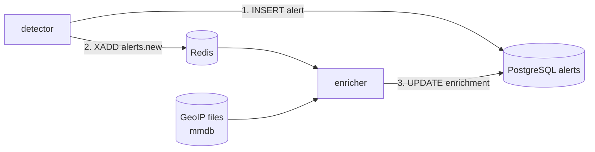

# Alert enrichment

Context added to an alert **after** it is stored: where the source address is, and which network
owns it. Code in `backend/src/sentinel_core/enrichment/` and `workers/enricher.py`. This first
provider is GeoIP; reputation (AbuseIPDB) and a risk score come next (M3).



## Design

- **Never on the detection path.** The detector stores the alert, *then* announces it on
  `alerts.new`. A missing database, a crashed enricher or (later) a slow reputation API can leave an
  alert without context; it can never lose or delay one. If announcing fails, the batch is retried:
  the same event re-raises the same alert (a no-op in the table) and it is announced again.
- **Local lookups, nothing leaves the machine.** GeoIP reads files (MaxMind format) with `maxminddb`:
  no address of yours is ever sent to a third party. Only the two database files are downloaded.
- **Idempotent.** Enrichment is a pure function of the source address and the databases, so a
  redelivered announcement rewrites the same result.
- **Bounded.** `alerts.new` is capped (`SENTINEL_ALERTS_STREAM_MAXLEN`, default 100 000): if the
  enricher is down for a very long time the oldest announcements are dropped, those alerts stay
  without context, and memory stays bounded. This is safe because the alert itself is already stored;
  it is the opposite choice from `events.raw`, where dropping would lose data.
- **Fail loud at startup.** The enricher exits with the reason if enrichment is disabled or a
  database is missing, unreadable, or of the wrong kind (an ASN file given as the city one), instead
  of running and enriching nothing.
- **Untrusted values.** Database strings end up in alerts and later in a web page. Every value is
  type-checked, stripped of control characters and bounded (100 characters, coordinates in range,
  country codes of two letters); the CLI escapes what it prints again.

## What is stored

`alerts.enrichment` (JSON, `NULL` until enriched and for alerts without a source address) and
`alerts.enriched_at`:

```json
{
  "ip_scope": "public",
  "geo": {"country_code": "DE", "country": "Germany", "city": "Berlin",
          "latitude": 52.52, "longitude": 13.405, "asn": 60729, "as_org": "Stiftung Erneuerbare Freiheit"}
}
```

- `ip_scope`: `public`, or `non_public` for private, loopback, link-local, documentation, multicast
  and other reserved ranges (there is nothing to look up: `geo` is `null`). A lab attacker on
  `192.168.x.x` is therefore `non_public`.
- `geo` is `null` for a public address the databases do not know; any field of it may be missing.
- `sentinel alerts list` shows a country column; `sentinel alerts show` prints a `from` line.

## Set it up

```bash
deploy/fetch-geoip.sh                      # DB-IP Lite city + ASN into deploy/geoip/ (~130 MB)
# deploy/.env:  SENTINEL_ENRICHMENT_ENABLED=true   and   COMPOSE_PROFILES=enrichment
cd deploy && docker compose up -d --build  # starts the enricher and tells the detector to announce alerts
docker compose logs -f enricher
```

Refresh the databases monthly by running the script again and `docker compose restart enricher`.
Alerts stored before enrichment was enabled stay without context (there is no backfill yet).
Any MaxMind-format database works (GeoLite2-City / GeoLite2-ASN too): set
`SENTINEL_GEOIP_CITY_DB` / `SENTINEL_GEOIP_ASN_DB`.

## Data and licence

IP geolocation data by [DB-IP](https://db-ip.com), licensed under the
[Creative Commons Attribution 4.0](https://creativecommons.org/licenses/by/4.0/) license. The
attribution must stay wherever the data is shown (the dashboard will carry it). The files are
ignored by Git and never committed.

## Limits

- **Geolocation is approximate and sometimes wrong.** It locates the *registered* or *typical*
  place of an address block, not the machine. Real lookups made while building this: `1.1.1.1`
  (Cloudflare, anycast) is placed in Sydney, `2001:4860:4860::8888` (Google) in Montreal. VPNs, Tor
  exit nodes, mobile carriers and cloud providers make it worse. Treat it as context for a human,
  never as proof: rules that will depend on it (impossible travel) must say so and use a margin.
- The free databases have a city-level precision at best, and no accuracy radius is stored.
- The country is not a risk signal by itself. A risk score will combine several signals (M3).
- No backfill of old alerts, no reverse DNS, no reputation yet.
