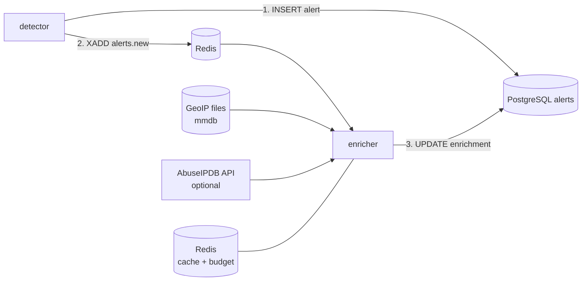

# Alert enrichment

Context added to an alert **after** it is stored: where the source address is, and which network
owns it, and how badly it has been reported. Code in `backend/src/sentinel_core/enrichment/` and
`workers/enricher.py`. Providers: GeoIP (local files) and AbuseIPDB reputation (optional, a web API).
A **risk score** combines the rule's severity with this context (below).



## Design

- **Never on the detection path.** The detector stores the alert, *then* announces it on
  `alerts.new`. A missing database, a crashed enricher or (later) a slow reputation API can leave an
  alert without context; it can never lose or delay one. If announcing fails, the batch is retried:
  the same event re-raises the same alert (a no-op in the table) and it is announced again.
- **GeoIP is local: nothing leaves the machine.** It reads files (MaxMind format) with `maxminddb`.
  Reputation is different, see below: it sends the address to a third party.
- **Idempotent.** Enrichment is a pure function of the source address and the databases, so a
  redelivered announcement rewrites the same result.
- **Bounded.** `alerts.new` is capped (`SENTINEL_ALERTS_STREAM_MAXLEN`, default 100 000): if the
  enricher is down for a very long time the oldest announcements are dropped, those alerts stay
  without context, and memory stays bounded. This is safe because the alert itself is already stored;
  it is the opposite choice from `events.raw`, where dropping would lose data.
- **Fail loud at startup.** The enricher exits with the reason if enrichment is disabled or a
  database is missing, unreadable, or of the wrong kind (an ASN file given as the city one), instead
  of running and enriching nothing.
- **Untrusted values.** Database strings end up in alerts and later in a web page. Every value is
  type-checked, stripped of control characters and bounded (100 characters, coordinates in range,
  country codes of two letters); the CLI escapes what it prints again.

## What is stored

`alerts.enrichment` (JSON, `NULL` until enriched and for alerts without a source address) and
`alerts.enriched_at`:

```json
{
  "ip_scope": "public",
  "geo": {"country_code": "DE", "country": "Germany", "city": "Berlin",
          "latitude": 52.52, "longitude": 13.405, "asn": 60729, "as_org": "Stiftung Erneuerbare Freiheit"},
  "reputation": {"source": "abuseipdb", "score": 100, "total_reports": 329, "distinct_reporters": 113,
                 "last_reported_at": "2026-09-26T13:36:45Z", "usage_type": "University/College/School",
                 "isp": "Artikel10 e.V.", "is_tor": true, "is_whitelisted": false,
                 "checked_at": "2026-09-26T20:29:31Z"}
}
```

- `ip_scope`: `public`, or `non_public` for private, loopback, link-local, documentation, multicast
  and other reserved ranges (there is nothing to look up: `geo` is `null`). A lab attacker on
  `192.168.x.x` is therefore `non_public`.
- `geo` is `null` for a public address the databases do not know; any field of it may be missing.
- `reputation` is present only for public addresses, only when a key is configured and the provider
  answered; `checked_at` is when the provider was asked (a cached answer is up to 24 h old).
- `sentinel alerts list` shows a country and an abuse-score column; `sentinel alerts show` prints a
  `from` and an `abuse` line.

## Set it up

```bash
deploy/fetch-geoip.sh                      # DB-IP Lite city + ASN into deploy/geoip/ (~130 MB)
# deploy/.env:  SENTINEL_ENRICHMENT_ENABLED=true   and   COMPOSE_PROFILES=enrichment
cd deploy && docker compose up -d --build  # starts the enricher and tells the detector to announce alerts
docker compose logs -f enricher
```

Refresh the databases monthly by running the script again and `docker compose restart enricher`.
Alerts stored before enrichment was enabled stay without context (there is no backfill yet).
Any MaxMind-format database works (GeoLite2-City / GeoLite2-ASN too): set
`SENTINEL_GEOIP_CITY_DB` / `SENTINEL_GEOIP_ASN_DB`.

## Reputation (AbuseIPDB)

**Privacy first: this is the one place an address leaves the machine.** With a key configured, the
*public* source address of an alert is sent to abuseipdb.com (over HTTPS) to ask how many people
reported it. It is off unless `SENTINEL_ABUSEIPDB_API_KEY` is set. Private, loopback, reserved and
multicast addresses are never sent: this is checked twice (in the enricher and again in the client,
which refuses them before building a request) and covered by tests.

```bash
# deploy/.env (never committed): a free key from abuseipdb.com -> Account -> API
SENTINEL_ABUSEIPDB_API_KEY=...
# optional: SENTINEL_ABUSEIPDB_DAILY_LIMIT=900  (free plan: 1000 requests a day)
docker compose up -d --build enricher
```

How a lookup goes, in order:

1. **Cache** (Redis, 24 h, shared by all workers): an address seen recently is not asked again.
2. **Pause active?** After a problem the enricher stops asking for a while (below), so that one
   incident does not cost one timeout per alert.
3. **Daily budget** (default 900, kept below the plan's 1000; a counter per UTC day): when spent,
   lookups pause until midnight UTC. Cached answers keep being served.
4. **The request**, 5 s timeout, key in a header (never in the URL, an error message or a log).

| Situation | What happens |
|---|---|
| HTTP 429, or the last request of the period (`X-RateLimit-Remaining: 0`) | Pause for `Retry-After` / until `X-RateLimit-Reset`, else until midnight UTC |
| HTTP 401/403 (key refused) | ERROR logged once, pause 1 h |
| Network error, timeout, 5xx, or an answer that does not match the documented format | Pause 60 s, nothing cached |
| HTTP 422 (address refused) | That alert only; no pause |
| Any of the above | The alert keeps its GeoIP context and has no `reputation`. It is never lost, and no retry is scheduled |

The answer is untrusted: it is parsed strictly (integer score 0-100, non-negative counts, valid
dates), its text is stripped of control characters and truncated, and redirects are never followed
(the key must not travel to another host). Redis errors are not swallowed: the batch is retried.

## Risk score

Every alert the enricher processes gets a **risk score, 0-100**, stored in `alerts.risk_score`
(indexed, for sorting) and `alerts.risk` (level and factors). It exists to rank alerts, and it is
built so that anyone can see and challenge *why*: the rule's severity is the starting point (its
author's judgement of the behaviour), a few context factors move it, every factor has a name and a
reason, and the factors always add up to the score.

| Factor | Points | When |
|---|---|---|
| rule severity | the rule's `severity` (0-100) | always |
| reputation | AbuseIPDB abuse confidence ÷ 4, rounded down (0 to +25) | a reputation was fetched and the address is not whitelisted |
| tor exit | +5 | AbuseIPDB says the source is a Tor exit node |
| hosting network | +5 | the usage type says data center / hosting |
| cap | negative | only if the sum exceeds 100 |

Levels: **low** < 40, **medium** 40-69, **high** 70-94, **critical** ≥ 95. Critical is deliberately
rare: a failed SSH brute force (severity 60) from the worst-reputed Tor exit scores 90, *high*; a
login that succeeded after failures (severity 85) from a source with a middling reputation is
critical.

```
risk    90/100 (high)
          +60 rule severity: severity 60 set by the rule
          +25 reputation: AbuseIPDB abuse confidence 100/100 (a quarter of it)
          +5 tor exit: the source is a Tor exit node
```

- Alerts **without a source address** (sudo and account rules) or whose enrichment failed still get
  a score: it equals the rule's severity. So every processed alert can be ranked.
- **The country is not used**: it says nothing about intent, and scoring by country would be biased
  and easy to game. `non_public` sources get no adjustment either.
- **These weights are judgement calls, not measurements.** They are constants in
  `enrichment/risk.py`, covered by tests that pin the boundaries and the arithmetic; change them
  there, deliberately. The score has never been calibrated against real incident data.
- The score is computed by the enricher: with enrichment disabled (the default), alerts have no
  risk score and only their rule severity.
- Alerts stored before this feature have no score (`risk    not scored yet`); there is no backfill.

## Data and licence

Reputation data comes from [AbuseIPDB](https://www.abuseipdb.com) (see their terms for the free
plan). IP geolocation data by [DB-IP](https://db-ip.com), licensed under the
[Creative Commons Attribution 4.0](https://creativecommons.org/licenses/by/4.0/) license. The
attribution must stay wherever the data is shown (the dashboard will carry it). The files are
ignored by Git and never committed.

## Limits

- **Geolocation is approximate and sometimes wrong.** It locates the *registered* or *typical*
  place of an address block, not the machine. Real lookups made while building this: `1.1.1.1`
  (Cloudflare, anycast) is placed in Sydney, `2001:4860:4860::8888` (Google) in Montreal. VPNs, Tor
  exit nodes, mobile carriers and cloud providers make it worse. Treat it as context for a human,
  never as proof: rules that will depend on it (impossible travel) must say so and use a margin.
- The free databases have a city-level precision at best, and no accuracy radius is stored.
- The country is not a risk signal by itself (it is not used in the risk score).
- **A reputation is a lead, not a verdict.** AbuseIPDB scores come from user reports: an address
  that only scanned once may score 0, and shared addresses (NAT, VPN exits, cloud hosts) can score
  high because of someone else. A score of 0 for `8.8.8.8` (whitelisted) is right; a score of 100 for a
  Tor exit is right and says nothing about *this* attempt. It is one input of the risk score, worth at most 25 points.
- A failed lookup (quota, outage) is not retried later: that alert stays without a reputation, and its risk is computed without it. The
  cache means the next alert from the same address gets one once the provider answers again.
- No backfill of old alerts, no reverse DNS, one reputation provider.
