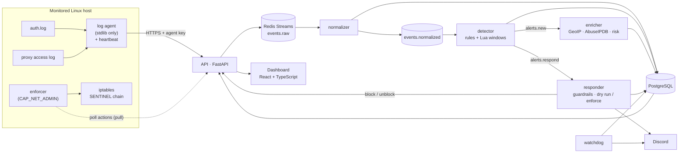

# What SentinelLite does, and how it fits together

The detailed tour. The [README](../README.md) is the short version; the design record with every rejected
alternative is [`ARCHITECTURE.md`](ARCHITECTURE.md).

## How it fits together

**Dumb agents, smart server.** Agents only tail files and ship raw lines; all parsing lives on the
server, so a parser bug is fixed without redeploying agents and raw events can be replayed.
**Pull, not push.** Response actions are fetched by the agent: no port is opened on a monitored host, no
privileged key is stored on the platform. Design record: [`docs/ARCHITECTURE.md`](ARCHITECTURE.md)
(42 decisions with the alternatives that were rejected) and a dated engineering log,
[`docs/DEVLOG.md`](DEVLOG.md).

## What it does

- **Collection** — a Linux agent tails `auth.log` and the reverse proxy's JSON access log:
  at-least-once delivery with a disk-backed position, rotation and truncation handling, exponential
  backoff, hardened `systemd` unit, a heartbeat every minute. It refuses to disable TLS verification and
  never reads its key from a config file. [`docs/AGENT.md`](AGENT.md)
- **Ingestion** — authenticated batches, size limits, explicit backpressure (`429` + `Retry-After`)
  instead of silently dropping events; poison input is quarantined in a dead-letter table.
- **Detection** — YAML rules validated strictly at load time (an unknown key refuses to load, so a typo
  can never become a silently missing detection). Threshold, distinct-count, sequence and stateful
  (impossible travel) rules; event-time sliding windows evaluated by an **atomic Lua script** in Redis;
  time-of-day conditions with mandatory time zones. SSH guessing and enumeration, sudo and account
  changes, web path scanning and login guessing. [`docs/DETECTION.md`](DETECTION.md)
- **Enrichment** — local GeoIP, optional AbuseIPDB (cached, quota-aware), and a risk score whose factors
  are listed, not a black box. Off the detection path: a slow provider can never delay an alert.
- **Response** — the responder decides which sources to block: only sweeping/guessing rules, public
  addresses only, an allowlist that always wins (IPv4-mapped IPv6 included), a mandatory TTL, a rate cap,
  an append-only audit log. In `enforce` a separate **enforcer** service on the host applies the block to
  `iptables` and lifts it at its end time even if the platform is gone; the agent re-checks every
  address itself, so a compromised platform can at worst drop traffic from a bounded set of public
  addresses for a bounded time. `dry_run` is the default. [`docs/OPERATIONS.md`](OPERATIONS.md)
- **Operate** — Discord notifications (blocks, releases), a **watchdog** that announces an agent that
  stopped reporting, `sentinel unblock`, and `sentinel report`, a printable HTML security report.
- **Dashboard** — alert list and detail with evidence, ATT&CK coverage, source map, incident triage, a
  Blocks page (admin-only actions, audited), optional TOTP two-factor authentication, login throttling.
  Argon2id, server-side sessions, `HttpOnly`/`SameSite=Strict` cookies, no self-registration.
  [`docs/DASHBOARD.md`](DASHBOARD.md)
