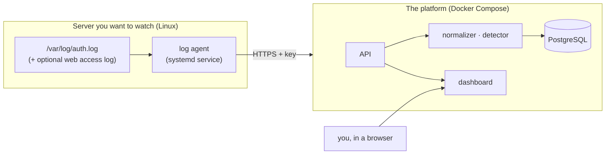

# Tutorial: from zero to your first alert

This guide takes you from an empty machine to a running SIEM that detects an attack on one of your own
servers, step by step. It takes about 30 minutes. Every command here was run on a real deployment;
where something is optional or not automated yet, it says so.

> **Only monitor and test machines you own.** The attacks in this tutorial are small and safe, but they
> must only ever be aimed at your own servers.

- [1. What you are going to build](#1-what-you-are-going-to-build)
- [2. Prerequisites](#2-prerequisites)
- [3. Start the platform](#3-start-the-platform)
- [4. Create your account](#4-create-your-account)
- [5. Register and install an agent](#5-register-and-install-an-agent)
- [6. Check that data flows](#6-check-that-data-flows)
- [7. Trigger your first detections](#7-trigger-your-first-detections)
- [8. Read an alert](#8-read-an-alert)
- [9. Turn on the automatic response](#9-turn-on-the-automatic-response)
- [10. Optional extras](#10-optional-extras)
- [11. Running it day to day](#11-running-it-day-to-day)
- [12. Troubleshooting](#12-troubleshooting)
- [13. Where to go next](#13-where-to-go-next)

## 1. What you are going to build



Two pieces, installed in different ways:

| Piece | Where | How |
|---|---|---|
| **The platform**: API, dashboard, workers, database | one machine, in Docker | `docker compose up` |
| **The agent**: reads logs on each server you watch | every monitored Linux server | a small Python program run by `systemd` |

The agent cannot run in Docker: it has to read the real log files of the machine and, if you enable the
response, change its real firewall. The platform and a monitored server can be **the same machine**
(simplest for a first try) or different ones.

## 2. Prerequisites

**For the platform:**

- Docker Engine with the Compose plugin (`docker compose version` works), or Docker Desktop / OrbStack.
- `git`.

**For a monitored server:**

- Linux with `systemd` and `sshd`, for example Ubuntu 22.04 or 24.04 (24.04 is the tested one).
- Python 3.11 or newer (`python3 --version`); Ubuntu 24.04 ships 3.12.
- Root access (`sudo`), and read access to `/var/log/auth.log` (Ubuntu/Debian keep it there; on other
  distributions the SSH log may live elsewhere, see [`AGENT.md`](AGENT.md)).

## 3. Start the platform

```bash
git clone https://github.com/yassineeljal/SentinelLite.git
cd SentinelLite/deploy
cp .env.example .env
```

Edit `deploy/.env` and set at least:

```bash
POSTGRES_PASSWORD=<a long random password>      # required, the stack refuses to start without it
SENTINEL_SESSION_COOKIE_SECURE=false            # ONLY for a first try over plain http://localhost
```

The second line matters: by default the dashboard cookie is only sent over HTTPS, so signing in over
plain `http://` would silently loop. Set it to `false` for a local trial, and **remove it (or set `true`)
as soon as the dashboard is reachable over HTTPS**.

Start everything. Either use the **published image** (fast, nothing to build):

```bash
docker compose -f docker-compose.yml -f docker-compose.images.yml up -d
# tip: put COMPOSE_FILE=docker-compose.yml:docker-compose.images.yml in .env, then plain `docker compose up -d` works
```

or **build it from the source** (a few minutes the first time):

```bash
docker compose up -d --build
```

Then check:

```bash
docker compose ps                  # api, normalizer, detector, watchdog: Up; migrate: Exited (0)
curl http://127.0.0.1:8000/healthz # {"status":"ok","version":"0.1.0"}
```

The published image is `ghcr.io/yassineeljal/sentinellite` (amd64 and arm64), one image for every service; pin
a release with `SENTINEL_VERSION=0.1.0` in `.env` (release tags are `0.1.0`, `0.1` and `latest`). While the
repository and its package are private you first need `docker login ghcr.io`.

By design the API is published on `127.0.0.1:8000` only. **Never set `SENTINEL_BIND_ADDR` to `0.0.0.0`**:
that would put your SIEM on the network without HTTPS. To reach it from elsewhere, put a reverse proxy
with HTTPS in front (see [section 11](#11-running-it-day-to-day)).

## 4. Create your account

There is no self-registration: you create the first account from the command line.

```bash
docker compose exec api sentinel users create --email you@example.com --role admin
# Password: (typed, not echoed, at least 12 characters)
```

Open <http://127.0.0.1:8000> and sign in. The dashboard is empty for now: nothing is reporting.

Roles: **admin** can do everything, **analyst** can read and triage but cannot lift blocks or edit the
allowlist.

## 5. Register and install an agent

### 5.1 Register it on the platform

```bash
docker compose exec api sentinel agents create --name my-server --os linux
# created agent my-server (…)
# key: 6f1c….<long secret>          <-- shown ONCE, copy it now
```

The key identifies this one agent. If you lose it, revoke the agent (`sentinel agents revoke <id>`) and
create another.

### 5.2 Install it on the monitored server: one command

The platform serves its own agent, so the version always matches. On the **server you want to watch**:

```bash
curl -fsSL https://siem.example.com/agent/install.sh | sudo bash -s -- \
    --server https://siem.example.com --key <the key>
```

(Platform and server on the same machine: `--server http://127.0.0.1:8000`.) To keep the key out of the
process list and your shell history, pass it in the environment instead:
`curl -fsSL … | sudo SENTINEL_AGENT_KEY=<the key> bash -s -- --server https://siem.example.com`.

You are piping a script into a root shell: read it first if you like
(`curl -fsSL https://siem.example.com/agent/install.sh | less`, it is about 200 readable lines, and
`--help` lists every option).

What it does, in order: checks that Python 3.11+ and `venv` are there and that the platform answers;
creates the unprivileged `sentinel-agent` account (in the `adm` group, to read `auth.log`); installs the
agent into `/opt/sentinel-agent`; writes `/etc/sentinel-agent/agent.toml` and the key (readable by the
agent only); installs and starts the hardened `systemd` service, and confirms it stays up. It is safe to
run again: it upgrades the agent and keeps your configuration and key (`--force` rewrites them).

Useful options: `--traefik-log /var/log/traefik/access.log` to also ship the web access log,
`--start-at beginning` to ship the existing history too, `--no-service` to install the files without
`systemd` (containers), `--uninstall` (and `--purge` to remove the key and configuration as well).

A new agent starts at the **end** of the log: it ships what happens from now on, not the history.

### 5.3 Manual installation

Prefer to do it by hand, or on a distribution the script does not know? The same steps, one by one, are in
[`AGENT.md`](AGENT.md#install-ubuntu--debian).

## 6. Check that data flows

On the platform:

```bash
docker compose exec api sentinel agents list
# <id>  my-server  linux  active  2026-09-30  last seen 2026-09-30 12:34:56Z
```

`last seen` moves forward every minute: the agent sends a heartbeat even when there is nothing to
ship. On the server, `journalctl -u sentinel-agent` prints `last minute: N line(s) delivered`.

If `last seen` says `never`, go to [Troubleshooting](#12-troubleshooting).

## 7. Trigger your first detections

Ideally from **another machine**, try to log in to the monitored server as users that do not exist.
Nothing is harmed: sshd only logs `Invalid user …`. (Running the same loop on the server itself, against
`127.0.0.1`, raises the same alerts, but a loopback or private source is never blocked by the response.)

```bash
for i in $(seq 1 12); do
  ssh -o BatchMode=yes -o ConnectTimeout=5 "nosuchuser$i@<your-server>" true 2>/dev/null
done
```

Within seconds, open the **Alerts** page. You should see:

- `ssh-invalid-user-flood`: ten or more unknown-user attempts from one address in a minute;
- `ssh-user-enumeration`: six or more *different* names tried;
- `ssh-slow-scan`: ten in an hour (a fast scan also counts as a slow one, by design);
- and `ssh-bruteforce` too, if your server still accepts passwords (sshd then also logs
  `Failed password`).

The same source producing several alerts is normal: each rule looks at the attack from a different
angle. If you enable the web access log ([section 10](#10-optional-extras)), a sweep of typical scanner
paths raises `web-path-probing`:

```bash
for p in /.env /.git/config /wp-login.php /phpmyadmin/index.php /backup.sql; do
  curl -s -o /dev/null "https://<your-site>$p"; done
```

## 8. Read an alert

Click an alert. You get, in this order:

- **What and when**: the rule, its MITRE ATT&CK technique (T1110 is credential guessing), how long
  detection took.
- **Who and where**: the source address, and, when GeoIP is on, country, city and network.
- **Risk**: a score with the reason for **every** factor, so it is never a black box.
- **Evidence**: the exact log lines that triggered it.

The rest of the dashboard:

| Page | What it is for |
|---|---|
| **Alerts** | The live list (refreshes every 15 s), filter by rule |
| **Incidents** | Group related alerts, assign, take notes, close. Create one from an alert's page |
| **Blocks** | What the responder blocked, or would block; lift a block; manage the allowlist |
| **Map** / **MITRE ATT&CK** | Where attacks come from (needs GeoIP), and which techniques you see |
| **Security** | Turn on two-factor authentication for your account (see below) |

**Two-factor authentication.** Generate a key once and put it in `deploy/.env`, then recreate the API:

```bash
docker compose run --rm api python -c 'from cryptography.fernet import Fernet; print(Fernet.generate_key().decode())'
# add   SENTINEL_MFA_ENCRYPTION_KEY=<that key>   to deploy/.env, then:
docker compose up -d api
```

Keep a backup of that key **separate from the database**: losing it makes authenticator secrets
unreadable (recovery codes still work). Then enable 2FA on the **Security** page.

## 9. Turn on the automatic response

The responder decides which attackers to block. It ships **off**, and when on it starts in `dry_run`:
it records what it *would* block and touches nothing.

**Step 1: protect yourself first.** A block on your own address would cut you off. List every address
you connect from (`who` on the server shows your SSH source):

```bash
# deploy/.env
SENTINEL_RESPONDER_ENABLED=true
COMPOSE_PROFILES=response
SENTINEL_RESPONDER_ALLOWLIST=<your address>,<the platform's address>
```

```bash
docker compose up -d --build
docker compose exec api sentinel blocks          # what would be blocked, until when, and why
docker compose exec api sentinel allowlist add 203.0.113.7 --note "my office"
```

The safeguards: only sweeping/guessing rules can block (never a *successful* login), only public
addresses, the allowlist always wins, every block has a limited lifetime (1 hour by default), at most 10
new blocks a minute, and everything is written to an append-only audit log.

**Step 2: watch it for a few days.** Look at the **Blocks** page or `sentinel blocks`. Every "would
block" should be a real attacker. A wrong one? Add it to the allowlist.

**Step 3: enforce (only when you trust it).** Blocking for real needs the **enforcer** on each
monitored server, a second small service that applies the block to `iptables` and lifts it at its end
time. The full procedure, with the safety checks and how to undo everything, is in
[`OPERATIONS.md`](OPERATIONS.md#automated-response-dry-run-then-enforce) and [`AGENT.md`](AGENT.md#blocking-attackers-the-enforcer).
In short: add a `[response]` section to `agent.toml` (with `never_block` listing your own addresses),
start with `backend = "log"` (applies nothing), enable `sentinel-agent-enforcer`, then set
`SENTINEL_RESPONDER_MODE=enforce`.

A false positive, undone in seconds:

```bash
docker compose exec api sentinel unblock 203.0.113.7
```

## 10. Optional extras

| Want | How |
|---|---|
| **Countries and cities on alerts** | `deploy/fetch-geoip.sh`, then `SENTINEL_ENRICHMENT_ENABLED=true` and `COMPOSE_PROFILES=response,enrichment`. Free DB-IP data, looked up locally, no address leaves your server |
| **Discord notifications** (blocks, releases, silent agents) | Create a webhook in a Discord channel, set `SENTINEL_DISCORD_WEBHOOK_URL` |
| **Web scan and login-guessing detection** | Enable Traefik's JSON access log and add it as a source: [`OPERATIONS.md`](OPERATIONS.md#web-access-logs-traefik) |
| **A printable report** | `docker compose exec api sentinel report --days 7 --output /tmp/report.html`, copy it out with `docker compose cp api:/tmp/report.html .`, open it and print to PDF |
| **IP reputation (AbuseIPDB)** | `SENTINEL_ABUSEIPDB_API_KEY` in `.env`. **This sends the public source address of alerts to abuseipdb.com**; leave it empty to keep everything local |

The **watchdog** is always on: if an agent stops reporting for five minutes it says so in its log and on
Discord (`docker compose logs watchdog`).

## 11. Running it day to day

**HTTPS.** For anything beyond a first try, serve the dashboard over HTTPS through a reverse proxy
(Caddy, Traefik, Nginx…) and set `SENTINEL_SESSION_COOKIE_SECURE=true`. A worked example, with Coolify's
Traefik and Let's Encrypt, is in [`OPERATIONS.md`](OPERATIONS.md#deploy-on-a-vps-behind-coolifys-proxy)
(`deploy/docker-compose.vps.yml`).

**Update.**

```bash
cd SentinelLite && git pull
cd deploy && docker compose up -d --build     # migrations run automatically
```

Update the agents too when the release notes say so (`pip install --force-reinstall --no-deps` the new
wheel into `/opt/sentinel-agent`, then `systemctl restart sentinel-agent`).

**Back up** (do this before an update, and on a schedule):

```bash
docker compose exec -T postgres sh -c 'pg_dump -U "$POSTGRES_USER" "$POSTGRES_DB"' | gzip > sentinel-$(date +%F).sql.gz
```

To restore into an empty database: `gunzip -c sentinel-….sql.gz | docker compose exec -T postgres sh -c 'psql -U "$POSTGRES_USER" -d "$POSTGRES_DB"'`.
Back up `deploy/.env` too (it holds the 2FA key).

**Look at what is happening.**

```bash
docker compose logs -f detector        # rules loaded, alerts raised
docker compose logs -f normalizer      # events parsed, dead letters
docker compose ps                      # everything Up?
```

**Disk.** Events are stored in daily partitions and **nothing purges old ones yet**: watch the database
size, and drop old partitions by hand if it grows (see [`OPERATIONS.md`](OPERATIONS.md)).

**Uninstall.** On the platform: `docker compose down -v` (`-v` also deletes the database).
On each server: `sudo systemctl disable --now sentinel-agent sentinel-agent-enforcer`, remove the unit
files, `/opt/sentinel-agent`, `/etc/sentinel-agent`, `/var/lib/sentinel-agent`, and, if you ever
enforced, flush the chain with `sudo iptables -F SENTINEL` first.

## 12. Troubleshooting

| Symptom | Likely cause and fix |
|---|---|
| `docker compose up` fails on `POSTGRES_PASSWORD` | `deploy/.env` is missing or the variable is empty |
| You sign in and land back on the login page | The cookie is `Secure` but you are on plain `http://`: set `SENTINEL_SESSION_COOKIE_SECURE=false` for a local try, or use HTTPS |
| `sentinel agents list` says `last seen never` | The agent does not reach the platform: `journalctl -u sentinel-agent`. Wrong `url`? Firewall? On the server: `curl <url>/healthz` |
| The agent exits with code 1 | Configuration error: the message on stderr names the key to fix (unknown keys are refused on purpose) |
| The agent exits with code 2 | The key was refused (revoked or wrong database): create a new agent and key |
| The agent is up, but no alert appears | Are lines arriving? `docker compose logs normalizer`. Is the log path right for your distribution? Does `sentinel-agent` belong to the `adm` group (`id sentinel-agent`)? Did you attack from the server itself (use another machine)? |
| Lots of "dead letters" | Lines the platform cannot parse, for example an unsupported source: `docker compose logs normalizer` |
| Ingestion answers `429` | The queue is full: the normalizer is down or slow, `docker compose ps` |
| Test alerts you want gone | See [Removing test data](OPERATIONS.md#removing-test-data) |
| Blocked yourself in `enforce` | From the console: `sudo iptables -F SENTINEL`; then add your address to `never_block` and to the allowlist |

More: [`OPERATIONS.md`](OPERATIONS.md#troubleshooting).

## 13. Where to go next

| To… | Read |
|---|---|
| Understand how it works | [`ARCHITECTURE.md`](ARCHITECTURE.md) (with the alternatives that were rejected) |
| Write or change a detection rule | [`DETECTION.md`](DETECTION.md): rule format, and how to add a rule **with its attack, benign and near-miss scenarios** |
| Check the numbers yourself | `cd backend && uv run sentinel bench`, and [`BENCHMARK.md`](BENCHMARK.md) |
| See a real attack end to end | [`../lab/README.md`](../lab/README.md): a lab with Kali and `hydra` |
| Show it to someone | [`DEMO.md`](DEMO.md): a three-minute walkthrough |
| Compare with other tools | [`COMPARISON.md`](COMPARISON.md) |
