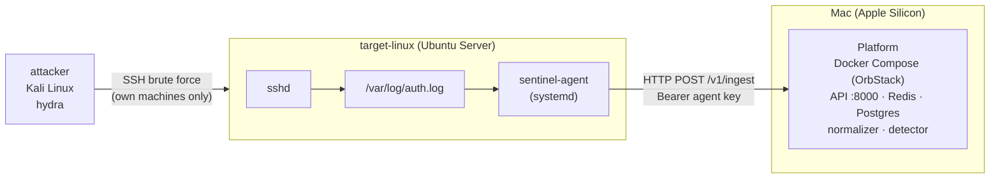

# SentinelLite lab

A small, isolated lab to run the platform against **real** attacks: a Linux target that is monitored,
an attacker machine, and the platform (the Docker Compose stack on the Mac).



**Rule of the lab: attack only machines you own.** The attack script refuses any non-private target.

## Two ways to build it

| | **A. OrbStack machines** | **B. UTM virtual machines** |
|---|---|---|
| Status | **Validated end to end** (results below) | Documented, **not executed yet** |
| Effort | 2 commands per machine, no installer | Install Ubuntu from an ISO (~10 min per VM) |
| Network | NAT, machines have Internet access; the API stays bound to `127.0.0.1` | Host-only network available (no Internet for the attacker); the API must be bound to the host's address on that network |
| Windows (M6) | Not possible | Needed for the Windows VM |

Both give a real Linux (real `sshd`, `rsyslog`, `systemd`): the agent, its systemd unit and the
detection behave the same. Start with **A** to see the whole chain working; use **B** for the isolated
lab and for Windows later.

The `lab/scripts/` work for both. Prerequisite: the platform is running
(`cd deploy && docker compose up -d`, see [`docs/OPERATIONS.md`](../docs/OPERATIONS.md)) and `uv` is
installed on the Mac.

## A. OrbStack machines (validated)

```bash
export PATH="$HOME/.orbstack/bin:$PATH"          # if `orb` is not found
orb create ubuntu:noble sl-target                # Ubuntu 24.04, arm64
orb create kali sl-attacker                      # Kali Linux, arm64

# Install and start the agent on the target (registers the agent, ships the key over SSH)
lab/scripts/deploy-agent.sh --host sl-target@orb \
    --server-url http://host.orb.internal:8000 --name lab-target-1 --with-sshd

# The attacker needs hydra
orb -m sl-attacker bash -lc 'sudo apt-get update -qq && sudo apt-get install -y hydra'

# Attack (from the attacker, against the target's IP: `orb list` shows it)
orb -m sl-attacker "$PWD/lab/scripts/attack-ssh-bruteforce.sh" 192.168.139.12 root
#   -> prints attack_start_ms=...

# Read the result on the platform
docker compose -f deploy/docker-compose.yml exec api sentinel alerts list
lab/scripts/detection-delay.sh <attacker IP> <attack_start_ms>
```

Notes:
- `host.orb.internal` is how an OrbStack machine reaches the Mac: it lands on the Mac's `localhost`,
  so **the API can stay bound to `127.0.0.1`** (the safe default). The bridge IP does *not* work
  (`192.168.139.3:8000` was refused while `host.orb.internal:8000` answered).
- `deploy-agent.sh --with-sshd` installs `openssh-server` (absent from OrbStack's Ubuntu image).
- Stop and delete when done: `orb stop sl-target sl-attacker`, `orb delete sl-target sl-attacker`.

## B. UTM virtual machines (documented, not executed)

Read this section knowing the steps come from UTM's and Kali's documentation and could not be
tried while writing it; the *scripts* used after the VMs exist are the ones validated in A. Your
existing UTM VMs are not touched: give the new ones distinct names (`sentinel-target-linux`,
`sentinel-attacker`).

Sizing for a 16 GB Mac (the Docker platform needs ~3 GB): target 2 GB RAM / 20 GB disk, attacker
3 GB RAM / 25 GB disk.

### 1. Networking (the part that differs per machine)

UTM offers these modes ([UTM documentation, QEMU backend](https://docs.getutm.app/settings-qemu/devices/network/network/)):

| Mode | Meaning |
|---|---|
| Shared Network | The guest can reach the host and the Internet |
| **Host Only** | "Similar to shared network except WAN traffic is blocked so the guest cannot access the Internet" |
| Bridged | Layer-2 bridge on a physical interface (advanced) |
| Emulated VLAN | Userspace network; needs port forwarding to reach the guest |

The Apple Virtualization backend only offers **Shared Network** and **Bridged**
([documentation](https://docs.getutm.app/settings-apple/devices/network/)), so use the **QEMU
backend** (leave "Use Apple Virtualization" unchecked in the wizard) if you want Host Only.
Recommended: **Shared Network while installing and updating packages, then Host Only for the
attacks**, so that the attacker cannot reach the Internet by mistake.

> **Do not assume the host's address.** On this Mac the shared network is `192.168.139.x` with the
> host at `192.168.139.3`, not the `192.168.64.1` often quoted. Find it while a VM is running:
> `ifconfig | grep -B1 -A4 bridge` on the Mac, or `ip route` inside a guest. Check the VMs see each
> other and the host: `ping <other VM>` and `curl http://<host IP>:8000/healthz`. UTM's docs do not
> state whether two Host Only guests can reach each other: test it, and if they cannot, keep both
> machines on Shared Network and rely on the attack script's private-address check.

### 2. Bind the API to the host address the VMs can reach

The API is published on `127.0.0.1` by default, which the VMs cannot reach. Set the address of the
Mac on the VM network (never `0.0.0.0`: that would expose the SIEM on your Wi-Fi):

```bash
# deploy/.env
SENTINEL_BIND_ADDR=192.168.139.3       # the host address you found above
```

The interface exists only while a VM using that network is running: **start the VMs first, then**
`docker compose up -d` (restart the `api` service after a reboot). If binding fails, this is why.

### 3. Target: Ubuntu Server

Follow [UTM's Ubuntu guide](https://docs.getutm.app/guides/ubuntu/) with the **ARM64** server ISO
(`ubuntu-24.04.5-live-server-arm64.iso`, 3.6 GB, from
[cdimage.ubuntu.com](https://cdimage.ubuntu.com/releases/24.04/release/); check it against
`SHA256SUMS`). In the installer create a user and tick **Install OpenSSH server**. After the
reboot, remove the ISO from the virtual drive. UTM's guide notes that on Apple Silicon a slow first
boot can come from the `*-wait-online` services.

Then, from the Mac, install the agent (adjust the user, IP and the API URL):

```bash
ssh-copy-id <user>@<target IP>          # once, so the scripts can use SSH without a password
lab/scripts/deploy-agent.sh --host <user>@<target IP> \
    --server-url http://<host IP>:8000 --name lab-target-1
```

The user needs `sudo`. rsyslog is installed by the script if missing (Ubuntu Server ships it, but
its absence would mean no `/var/log/auth.log` to follow).

### 4. Attacker: Kali (or a lighter equivalent)

Kali's own UTM guide ([Kali inside UTM](https://www.kali.org/docs/virtualization/install-utm-guest-vm/))
uses the Apple-silicon **installer ISO** and currently requires a workaround (a temporary *Serial*
device during the install, then switching the display to `virtio-gpu-pci`): follow that page, as
such details change. If you would rather not fight it, a **second Ubuntu Server VM with `hydra`**
does the same job (`sudo apt install hydra`) and is enough for this lab.

Copy `lab/scripts/attack-ssh-bruteforce.sh` and `lab/wordlists/small.txt` to the attacker (they must
stay in `scripts/` and `wordlists/` siblings, or pass the wordlist path).

## Run the attack and measure

```bash
# on the attacker
./attack-ssh-bruteforce.sh <target IP> root
# on the platform host, with the attack_start_ms it printed
lab/scripts/detection-delay.sh <attacker IP> <attack_start_ms>
```

`detection-delay.sh` reads the latest `ssh-bruteforce` alert of that source and prints the times of the
first failure, of the threshold (5th failure) and of the alert, and the delays between them. The
delays are only meaningful if the machines share a clock (true on OrbStack; keep NTP running in UTM
VMs).

## Result: measured on 2026-09-25 (path A)

Environment: Ubuntu 24.04.5 arm64 target, Kali rolling arm64 attacker, hydra 9.7 (4 parallel tasks,
20 passwords, user `root`), agent 0.1.0 under its systemd unit, platform on the Mac. The whole
chain was real: hydra → sshd → rsyslog → `auth.log` → `sentinel-agent` → API → Redis → normalizer →
Postgres → detector → alert.

| Event | Time after the attack started |
|---|---|
| Attack starts | 0 |
| First failed login logged by sshd | +3.8 s (hydra start-up, SSH handshake, sshd's authentication delay) |
| 5th failed login logged (threshold reached) | +6.9 s |
| **Alert stored** | **+7.4 s** |

The pipeline itself (5th failure logged → alert stored) took **473 ms** (agent polling interval
≤ 0.5 s included); the rest of the delay is how long the attacker takes to fail five times.
`ssh-bruteforce` needs 5 failures from one source in 60 s, so a faster attacker is detected faster.
**The M1 criterion "attack → alert in < 10 s" is met.** One run, one machine: a demonstration, not
a benchmark (the detection-rate and false-positive measurements are planned for M2).

Things the run also confirmed on a real host:
- `systemd-analyze security sentinel-agent`: exposure level **4.2 (OK)** with the shipped unit;
- the service runs as the dedicated `sentinel-agent` user (group `adm` for `auth.log`), its state
  directory is `0700`, and its configuration and key are not readable by other users;
- the agent reads `sshd` lines as written by real rsyslog on Ubuntu 24.04 (ISO timestamps with
  microseconds), and the normalizer parses them.

## Safety and hygiene

- Attack only your own machines. `attack-ssh-bruteforce.sh` accepts only private IPv4 addresses.
- With OrbStack machines the attacker has Internet access: do not point tools at anything but the
  lab IPs. For a stricter isolation use path B with Host Only.
- The agent's key is created on the platform, copied over SSH to `/etc/sentinel-agent/key` (`0600`)
  and never printed. Revoke it when the lab is torn down:
  `docker compose exec api sentinel agents revoke <id>` (`sentinel agents list` shows the ids).
- `http://` between the agent and the API is plaintext (the agent warns): acceptable on this lab
  network only.

## Troubleshooting

| Symptom | Cause / fix |
|---|---|
| `deploy-agent.sh`: "could not create the agent" | The stack is down, or the agent name is already taken (`sentinel agents list`) |
| Agent inactive right after install | `journalctl -u sentinel-agent -n 30` on the target. Exit codes: 1 config, 2 key refused, 3 log refused (see `docs/AGENT.md`) |
| Agent log says `Connection refused` / timeout | The target cannot reach the API: wrong `--server-url`; API still bound to `127.0.0.1` (path B); VMs not on the same network |
| `docker compose up` fails binding the API (path B) | The VM network interface does not exist yet: start the VMs first |
| Attack runs but no alert | `journalctl -u sentinel-agent` (lines delivered?), `sudo tail /var/log/auth.log` on the target (are failures logged?), `docker compose logs detector`. Failures from a source already seen earlier are subject to the 5-minute cooldown |
| Hydra reports `MaxStartups` / connection resets | sshd throttles parallel attempts: lower the tasks (`-t 2`) |
| `detection-delay.sh`: "no ssh-bruteforce alert" | The alert is not stored yet, or it came from another source IP (use the attacker's address as the target sees it) |

## Not validated yet

- **Path B (UTM) end to end**: the steps above follow the official documentation but were not run.
- **Windows** is out of scope (ADR 40): the platform monitors Linux only.
- A **multi-target** lab and the **response** side (blocking the attacker): M5.
